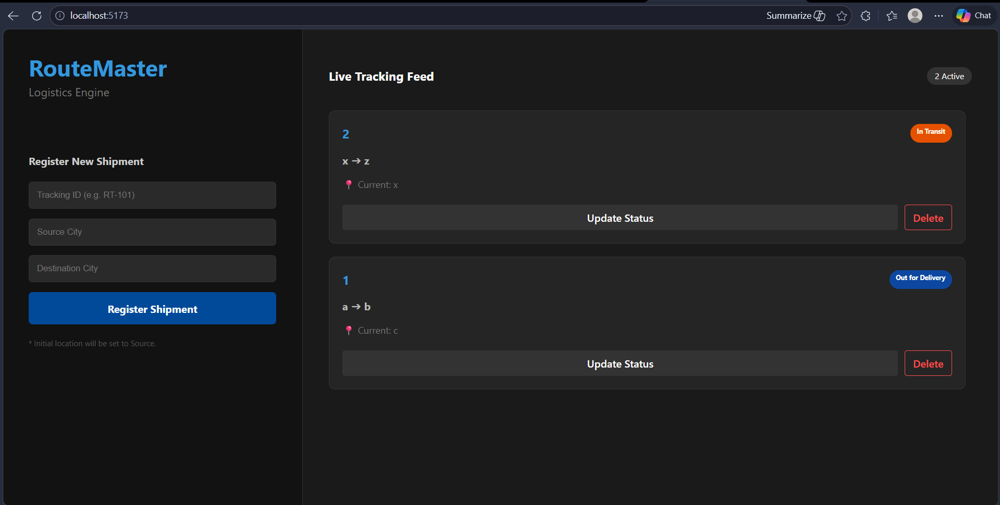

# RouteMaster | Logistics & Tracking Engine

RouteMaster is a containerized end-to-end logistics management system built with the MERN stack. It features a responsive dashboard for registering shipments and tracking their real-time status across different locations.



## 🚀 Key Features
- **Automated Routing:** Automatically synchronizes the initial shipment location with the source city upon registration.
- **Microservices Architecture:** Fully containerized using Docker and orchestrated with Docker Compose.
- **Live Tracking Feed:** A split-screen UI featuring a fixed control panel and a scrollable real-time tracking feed.
- **Data Persistence:** Integrated MongoDB with Docker Volumes to ensure data survives container restarts.

## 🛠️ Tech Stack
- **Frontend:** React.js (Vite), Axios, CSS3 (Flexbox/Grid)
- **Backend:** Node.js, Express.js
- **Database:** MongoDB, Mongoose (ODM)
- **Infrastructure:** Docker, Docker Compose

## 🏗️ DevOps Overview
The system is built as a set of decoupled services:
1. **Client:** React application optimized for modern browsers.
2. **API:** Express server handling CRUD operations and data validation.
3. **Database:** MongoDB instance running on a private Docker network for enhanced security.

## 🧠 Technical Architecture & Logic

### 1. The Microservices Approach
RouteMaster is designed as a set of decoupled services to mimic a production-scale logistics engine.
* **Separation of Concerns:** By separating the `client` (React) and `server` (Node/Express), the frontend can be scaled independently of the backend logic.
* **Inter-Service Communication:** The React client communicates with the Express API via a RESTful architecture, while the API interacts with MongoDB using Mongoose ODM for structured data modeling.

### 2. Docker Orchestration & Persistence
* **Networking:** I utilized a custom bridge network in Docker Compose, allowing the `server` to communicate with the `db` container using the service name (`mongodb://database:27017`) rather than unstable IP addresses.
* **Volumes:** To ensure data integrity, I implemented **Named Volumes**. This ensures that even if the containers are stopped or deleted, the shipment logs remain stored on the host machine and are re-attached upon the next launch.

### 3. CI/CD Pipeline (GitHub Actions)
I implemented a Continuous Integration pipeline to automate quality control:
* **Build Verification:** On every push, GitHub Actions spins up a virtual environment to verify that both the React and Node dependencies install correctly.
* **Container Validation:** The pipeline performs a `docker-compose build` to ensure the Dockerfiles are error-free and the images are ready for deployment.

### 4. Core Logistics Logic
* **Automated Origin Sync:** To reduce manual input errors, the backend logic automatically synchronizes the shipment's "Current Location" with the "Source City" upon registration.
* **Status Management:** The system uses a state-machine approach to handle shipment statuses (e.g., *Pending, Out for Delivery, Delivered*), ensuring data consistency across the UI.

## 🚦 Getting Started

### Prerequisites
- Docker & Docker Compose installed

### Installation & Execution
1. Clone the repository:
   ```bash
   git clone [https://github.com/PriyaanG663/routemaster-logistics-engine.git](https://github.com/PriyaanG663/routemaster-logistics-engine.git)
   cd routemaster-logistics-engine
2. Run it by : docker-compose up --build